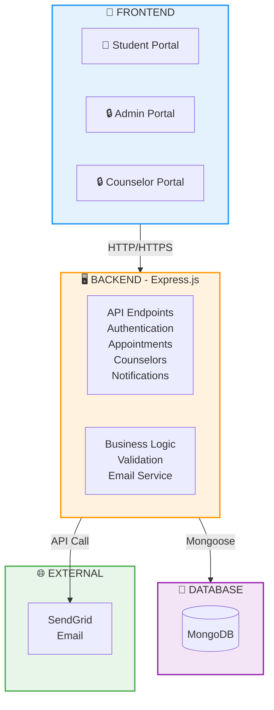

# JRMSU Counseling Appointment System - Simple Architecture Diagram



---

## Simple System Flow

```
STUDENT              ADMIN/COUNSELOR          SERVER             DATABASE
  │                        │                    │                    │
  ├─ Submit Request ──────────────────────────→ │                    │
  │                                              ├─ Validate        │
  │  ← ─ ─ Email Confirmation ← ─ ─ ─ ─ ─ ─ ─ ─┤ Store ──────────→ │
  │                                              │                    │
  │  View Status ──────────────────────────────→ │                    │
  │  ← ─ ─ Status Result ← ─ ─ ─ ─ ─ ─ ─ ─ ─ ─ ├ Retrieve ────────→ │
  │                                              │                    │
  │                        ├─ Approve/Reject ──→ │                    │
  │                        │                    ├─ Update ──────────→ │
  │  ← ─ ─ Decision Email ← ─ ─ ─ ─ ─ ─ ─ ─ ─ ─┤                    │
  │                                              │                    │
```

---

## Three User Portals

```
┌─────────────────────┬─────────────────────┬─────────────────────┐
│   Student Portal    │    Admin Portal     │  Counselor Portal   │
│   (Public Access)   │   (Protected)       │    (Protected)      │
├─────────────────────┼─────────────────────┼─────────────────────┤
│ • View Counselors   │ • Manage Users      │ • View Requests     │
│ • Book Appointment  │ • View All Data     │ • Approve/Reject    │
│ • Track Status      │ • Generate Reports  │ • Schedule Manage   │
│ • View Calendar     │ • System Settings   │ • See Notifications │
└─────────────────────┴─────────────────────┴─────────────────────┘
```

---

## Key Features

```
FRONTEND                BACKEND                 DATABASE
├─ HTML Pages      ├─ Express.js         ├─ MongoDB
├─ CSS Styling     ├─ 24+ API Routes     ├─ 3 Collections
├─ JavaScript      ├─ Authentication     │  ├─ Counselors
└─ User Interface  ├─ Email Integration  │  ├─ Appointments
                   ├─ Real-time Updates  │  └─ Notifications
                   └─ Data Validation    └─ JSON Fallback
```
